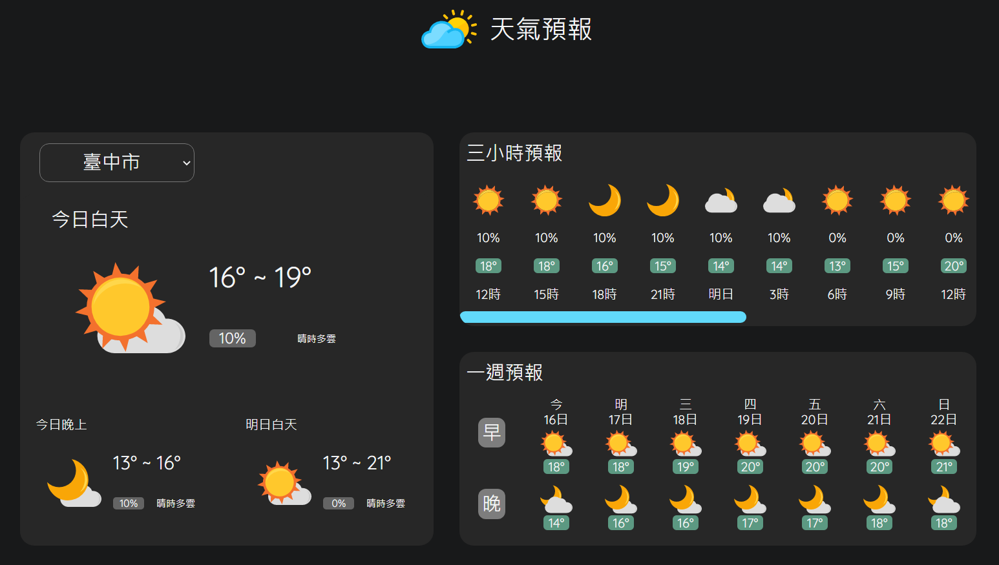

# 台灣天氣預報作品

## 專案功能
- 未來36小時天氣預報 (逐12小時)
- 未來2天天氣預報(逐3小時)
- 未來一週天氣預報

    [Live Demo](https://rayhcc.github.io/weather-forecast/)  
    
    

## 使用的主要技術
- React
- 串接 API ([使用氣象資料開放平台](https://opendata.cwb.gov.tw/index))
- RWD